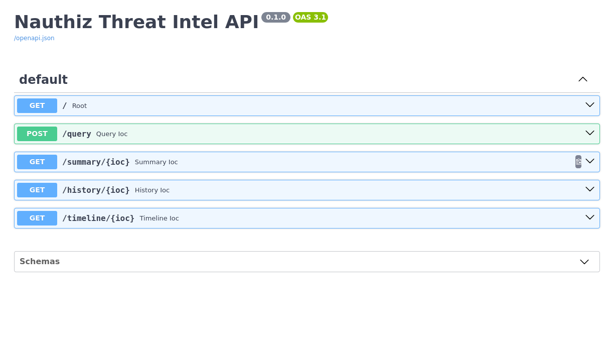
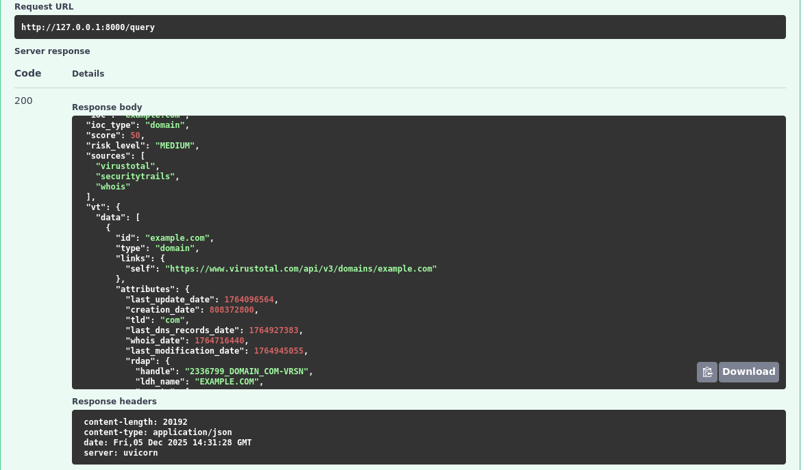
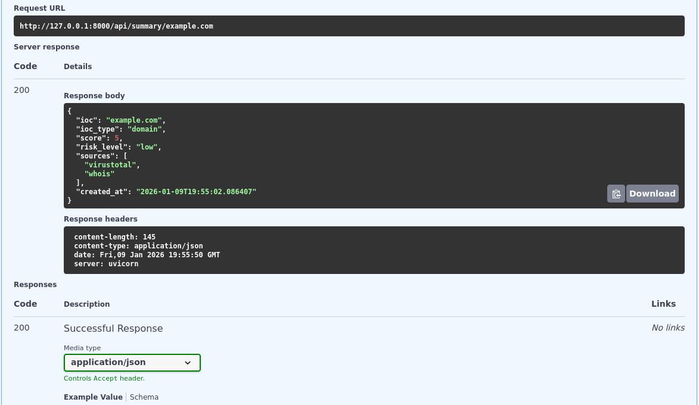
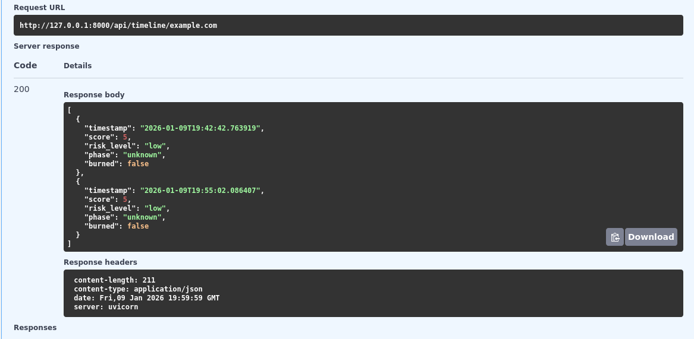

# Nauthiz – Threat Intelligence Enrichment API

[](https://python.org)
[](https://fastapi.tiangolo.org)
[](LICENSE)

Small, focused IOC build with FastAPI and SQLite. Query an IP or a domain, get threat intelligence score from VirusTotal, SecurityTrails, and WHOIS in seconds
---
## How it does 

Given an IP or domain and Nauthiz:
- **Enriches** the IOC via VirusTotal, SecurityTrails and WHOIS lookups
- **Scores** threat risk on level on a 0-100 scale, normalized to: `low` / `medium` / `high` / `critical`.
- **Persists** query history in SQLite with data integrity constraints.
- **Exposes** REST endpoints to query, summarize, view history and analyze temporal trends.

---

## Architecture
FastAPI (REST layer)
     ↓
Authentication (X-API-Key)
     ↓
IOC Enrichment (async providers)
 VirusTotal
 SecurityTrails
 WHOIS/Hunter
     ↓
Scoring (0-100 → risk level)
     ↓
SQLite (persistent storage)

---

## Features

### Security
- **API Key authentication** (`X-API-Key` header, not versioned in repo)
- **Environment variables** for sensitive credentials (`.env` file gotignored)
- **Database constraints** on score and risk_level values
- **Hardened file permissions** (`0700` directories, `0600` database)

### Integrations
- **VirusTotal** – Real-time malware detection and commubity scores
- **SecurityTrails** – Historical DNS resolutions and infrastructure records
- **WHOIS/Hunter** – Domain registration details and email discovery

### Data Persistence
- Every query stored with full enrichment data
- History endpoints to track IOC behavior over time
- Timeline endpoint with temporal markers: `first_seen`, `last_updated`, `activity_phase`, `burned_infra`

---

## Quik Start

# 1. Clone and Setup

```In Terminal 
git clone https://github.com/Esteban-Null/nauthiz.git
cd nauthiz

python3 -m venv venv
source venv/bin/activate #(Linux)

venv\Scripts\activate) #(windows)

pip install -r requirements.txt

2. Configure
# Create .env in the project root:

API_KEY=your-secret-key-here
PORT= 800
DATABASE_URL=sqlite://data/database.db

#Optional: Add your own API keys
VT_API_KEY=virustotal-apikey-here
ST_API_KEY=securitytrails-apikey-here
HUNTER_API_KEY=hunters-apikey-here```

#Get your own API-KEYS
VirusTotal - Free tier avalible
SeurityTrails - Free tier avalible
Hunters.io - Free tiers avalible

3 Run
#Initialize database (creates tables                                            and constraints)
python3 -c "from app.core.db import init_db; init_db()"

#Start the server
uvicorn main:app --reload

Open http:localhost:8000/doc (for Swagger interative docs)

## Endpoint Query IOC:

curl -X POST http://localhost:8000/api/query \
  -H "X-API-Key: your-secret-key-here" \
  -H "Content-Type: application/json" \
  -d '{"ioc": "example.com", "ioc_type": "domain"}'

## Nauthiz Response:

{
  "ioc": "example.com",
  "ioc_type": "domain",
  "score": 45,
  "risk_level": "medium",
  "sources": ["virustotal", "securitytrails", "whois"],
  "vt": { "detections": 2, "total": 89, "url": "..." },
  "st": { "resolutions": [...] },
  "whois": { "registrar": "...", "created_date": "..." },
  "created_at": "2024-12-10T16:47:23.456Z"
}

- POST /api/query
- GET /api/summary/{ioc}
- GET /api/history/{ioc}
- GET /api/timeline/{ioc}

## Demo

Interactive API documentation at /docs:
Swagger UI

Query Endpoint
Enrich IOCs with multiple threat intelligence providers:
POST /query
Summary

Latest assessment for an IOC:

GET /summary
Timeline
Temporal activity history:
GET /timeline

### API Documentation
Interactive Swagger UI at `/docs`:


### Query Endpoint
Enrich IOCs with multiple providers (VirusTotal, SecurityTrails, WHOIS):


### Summary
Latest query summary for an IOC:


### Timeline 
Temporal history of an IOC


Roadmap
• [ ] GraphQL endpoint for complex queries
• [ ] Batch IOC processing (/api/batch)
• [ ] Webhook delivery for risk changes
• [ ] Additional providers (GreyNoise, AbuseIPDB, urlscan.io)
• [ ] Temporal phase detection (active campaigns, burned infrastructure)
• [ ] Web UI dashboard with NetworkX graph visualization
• [ ] Rate limiting & quota management
• [ ] Redis caching layer
​
Contributing
Found a bug? Have an idea? Open an issue or submit a pull request

License
MIT License – see LICENSE file.
